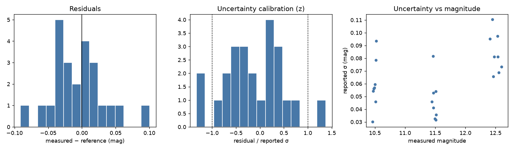

# The Telescope Net — Photometry Validation Report

*Prepared for AAVSO and scientific collaborators · Pipeline version 1.1.0 ·
2026-07-04*

## 1. Summary

The Telescope Net produces calibrated ensemble differential photometry from
Seestar-class telescopes and submits it to AAVSO in Extended File Format
(`FILT=CV`, `TRANS=NO`, `MTYPE=DIFF`, `CNAME=ENSEMBLE`). This report states
what the system can currently demonstrate, how that evidence was produced,
and what it cannot yet claim.

**Demonstrated (offline, deterministic, reproducible with one command):**

- On synthetic Seestar-like frames with known ground truth, the pipeline
  recovers magnitudes with **median bias −0.009 mag, RMS residual
  0.040 mag** over V 10.5–12.5 at typical stack depth, with **zero outliers**
  beyond max(0.3 mag, 3σ).
- Reported uncertainties are **conservative**: the ratio of true error to
  reported uncertainty has RMS ≈ 0.62 (a perfectly calibrated estimator
  would give 1.0; values < 1 over-estimate the error bar).
- Every tested failure mode — saturated target, saturated comparison star,
  moon-bright sky, sparse comparison field, gross WCS error, edge-of-frame
  target, calibration frames, low SNR, a wrong comparison-star magnitude —
  is either rejected with a machine-readable reason or measured and flagged
  below "good". **No pathological frame passes as "good".**
- Timing: BJD_TDB is computed at mid-exposure with the barycentric Rømer
  term verified against an independent computation to < 1 s.

**Not yet demonstrated (requires beta-node data, campaigns specified in
`FIXTURE_MANIFEST.md`):** external accuracy against AAVSO-curated sequences
on-sky, colour-term magnitude for extreme-colour targets, detector
linearity, crowded-field behaviour, and real cross-node scatter.

## 2. Methodology

### 2.1 Validation engine

`scripts/validate_photometry.py` runs the *production* pipeline
(`src/photometry.run_pipeline_ex`) over a corpus of FITS files with pinned
reference magnitudes and evaluates AAVSO-style acceptance gates:

| Gate | Threshold |
|---|---|
| Median residual vs reference | ≤ 0.05 mag |
| RMS residual (clean frames) | ≤ 0.10 mag |
| Uncertainty calibration RMS(residual/σ) | ≤ 1.5 |
| Outlier fraction (> max(0.3 mag, 3σ)) | ≤ 5 % |
| Pathological frames flagged "good" | 0 |

Runs are fully offline: comparison stars come from a frozen JSON catalog via
the pipeline's `file` catalog backend, WCS is taken from the header, and no
plate solver or network call executes. `results.json` retains every
measurement with full provenance and every rejection with its reason.

### 2.2 Synthetic corpus (current evidence)

Because no curated real-FITS corpus exists yet, current evidence uses
deterministic synthetic scenes (`tests/validation/synthimg.py`): Gaussian
PSFs at chosen magnitudes through a chosen zero point, Poisson + read noise
from a seeded RNG, real TAN WCS, optional saturation clipping, WCS offsets,
and catalog errors. 30 frames: 24 clean (V = 10.5/11.5/12.5 × 8 noise
realisations) + 6 pathological. Synthetic validation proves the *algorithms*
(centroiding, aperture photometry, noise model, ensemble calibration,
gates); it cannot prove sensor characteristics or sky systematics — those
claims are explicitly deferred to the real-data campaigns.

### 2.3 Regression suite

77 offline validation tests (`pytest tests/validation`) pin: the CCD noise
model against the analytic equation and Monte-Carlo scatter; FWHM recovery
(2.5–8 px, ±15 %); BJD mid-exposure shift and Rømer term; DATE-OBS format
tolerance; airmass fallbacks; quality-gate semantics including exact
equivalence to the legacy flag logic on its domain; AAVSO Extended Format
structure; WebObs response parsing (including WAF challenge pages);
cloud ingest bounds; and cross-node validation outlier logic.

## 3. Current results (synthetic corpus, 2026-07-04)

Full machine-readable results: `evidence/results.json`; figures:
`evidence/validation_summary.png`.

| Statistic | Value | Gate | Pass |
|---|---|---|---|
| Median residual | −0.009 mag | ≤ 0.05 | ✅ |
| RMS residual | 0.040 mag | ≤ 0.10 | ✅ |
| Max \|residual\| | 0.100 mag | — | — |
| Uncertainty calibration RMS(z) | 0.62 | ≤ 1.5 | ✅ |
| Outliers | 0 / 24 | ≤ 5 % | ✅ |
| Pathologies passing as "good" | 0 / 6 | = 0 | ✅ |

Quality-flag distribution: 16 good, 8 acceptable, 3 poor (the flagged
pathologies), 3 rejected (`non_light_frame`,
`too_few_comparison_stars`, `nonpositive_target_flux` for the gross-WCS
frame). Median reported uncertainty 0.058 mag; median zero-point scatter
0.046 mag.



## 4. Quality gates and auditability

Each measurement carries machine-readable quality evidence:

- `quality_flag` (good/acceptable/poor) from `evaluate_quality()` — a pure
  function gating SNR, uncertainty, comparison-star count, airmass,
  zero-point scatter (warn > 0.15, fail > 0.30 mag), and **saturation**
  (peak-pixel check on the target and every comparison star, default limit
  60 000 ADU).
- `quality_reasons`: each gate that did not pass at the "good" level, as
  `{check, value, threshold, outcome}`.
- `provenance`: pipeline version; WCS source (solved / header / pointing);
  time provenance (DATE-OBS, exposure, mid-exposure vs fallback);
  aperture/annulus radii and FWHM; gain/read-noise/saturation settings; sky
  level; and **per-comparison-star audit** — catalog of origin, catalog
  magnitude and error, pixel position, peak ADU, per-star zero point, and
  if excluded, why (`saturated`, `zp_sigma_clipped`, `nonpositive_flux`,
  `no_catalog_magnitude`).
- Frames that produce no measurement return a rejection record
  (`{stage, reason_code, message, detail}`) instead of a silent `None`.

Only `good`/`acceptable` measurements that cross-node validation did not
mark as outliers are submitted to AAVSO; single-node epochs are held back
6 h. Cloud ingestion is unchanged — the new fields are additive.

## 5. Known limitations and caveats

1. **Colour term (largest known systematic).** CV luminance calibrated
   against V-band comparisons carries an uncorrected colour term, up to
   ~0.1–0.3 mag for extreme-colour targets. Disclosed via `TRANS=NO/CV`;
   not included in the error bar.
2. **Coherent catalog bias is undetectable** by design of differential
   photometry and shared catalogs across nodes; pinned by test.
3. **Uncertainties are over-estimated ~1.6×** (zp_scatter used in full
   rather than as error of the mean). Conservative, to be recalibrated with
   real data.
4. **Sensor characteristics assumed, not measured**: 60 000 ADU saturation
   default, linearity, and the Seestar's internal calibration are
   uncharacterised pending campaigns C1–C2.
5. **No flat-fielding**; vignetting-induced position-dependent zero point
   appears only as inflated zp_scatter.
6. **Crowded fields untested**; centroid capture by blended neighbours is
   possible within ~15 px of the target position.
7. **Synthetic PSFs are Gaussian**; real Seestar PSFs (alt-az field
   rotation, optics) will differ — aperture photometry is first-order
   insensitive, but this is exactly what campaign C3 measures.

The complete ranked risk analysis is in `RISK_MAP.md`.

## 6. Reproducing this report

```bash
make validate           # full offline suite + synthetic corpus gates
# or:
python3 -m pytest tests/validation -q
python3 scripts/validate_photometry.py --synthetic --out /tmp/val
```

Both commands are network-free and deterministic (seeded RNG); the corpus
run exits non-zero if any gate fails, so the same command gates CI.

## 7. Next validation steps (ranked)

1. **C1 header-semantics ladder** — unblocks the timing claim on real stacks.
2. **C3 AAVSO standard-field campaign** — converts "algorithmically correct"
   into "accurate on sky against curated sequences", and measures the colour
   term directly.
3. **C2 linearity ladder** — replaces the assumed saturation limit.
4. **C4 known-variable cross-check** — residuals vs contemporaneous AAVSO
   light curves, including a red target.
5. **C5–C7** — crowding, multi-node scatter, vignetting.

Campaign specifications: `FIXTURE_MANIFEST.md`.
